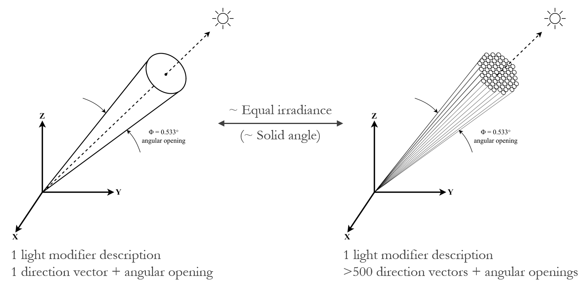

# RADYNVR-genmanysuns
A program to generate a Radiance sun description consisting of many mini suns.

<DOI to be added>

# SYNOPSIS
genmanysuns.py [-h] -FP _FOLDERPATH_ -SP _FILEPATH_ -ss _SQUARE_SIDE_

# DESCRIPTION
Generates a RADIANCE sun description of many small suns, based on a RADIANCE sun description of one sun. The program simulates an image of a sun, and uses the pixels of this image to generate sun direction vectors. The radiance of each small sun is adapted to achieve approximately equal irradiance in the scene, compared to the original sun description. To run the program, template files are needed. A solar angular opening of 0.533 degrees is assumed.
Special thanks to Prof. John Mardaljevic for his valuable contributions during the development of this program.

# OPTIONS
- -FP _folderpath_   A Path to a folder with template files for genmanysuns
- -SP _filepath_     A path to a RADIANCE sun description file
- -ss _res_          The dimension (in pixels) of the side of the square on which the suns should be based. A dimension of 32 pixels results in 632 suns, which is deemed adequate for most applications.
- -h                 Print list of command line options

# EXAMPLES
Generate a RADIANCE sun description of 632 small suns:
python genmanysuns.py -FP _folderpath_ -SP _filepath_ -ss _32_
Generate a RADIANCE sun description of 164 small suns:
python genmanysuns.py -FP _folderpath_ -SP _filepath_ -ss _16_

# DEPENDENCIES
- This program was designed and tested for Windows environments. It may encounter
compatibility issues when executed on Unix-based systems due to differences in
handling double quotes (") and single quotes (’), which are present in the template
files.
- RADIANCE 5.4
- Python version 3.6 or later
- Python libraries: argparse, math, os, pathlib, re, shutil, subprocess
- Template files (placed in one folder): 001-sun_template.rad, manysun.fmt, NNNsun_template.rad, x.vf

# LICENSE AND REFERENCING
This program has been developed by Sietse de Vries in the context of IntelLight+, an Eindhoven Engine project (partners: Signify, Eindhoven University of Technology). The program is licensed under the BSD 3-Clause "New" or "Revised" License, see the LICENSE file.
Special thanks to John Mardaljevic for his valuable contributions during the development of this method. Please refer to this program by citing: <DOI to be added>

This program is part of RADYNVR, a Radiance tool for simulating dynamic natural lighting for VR applications. See the Public_summary_RADYNVR file for more information. RADYNVR is available for education and research purposes upon request.

